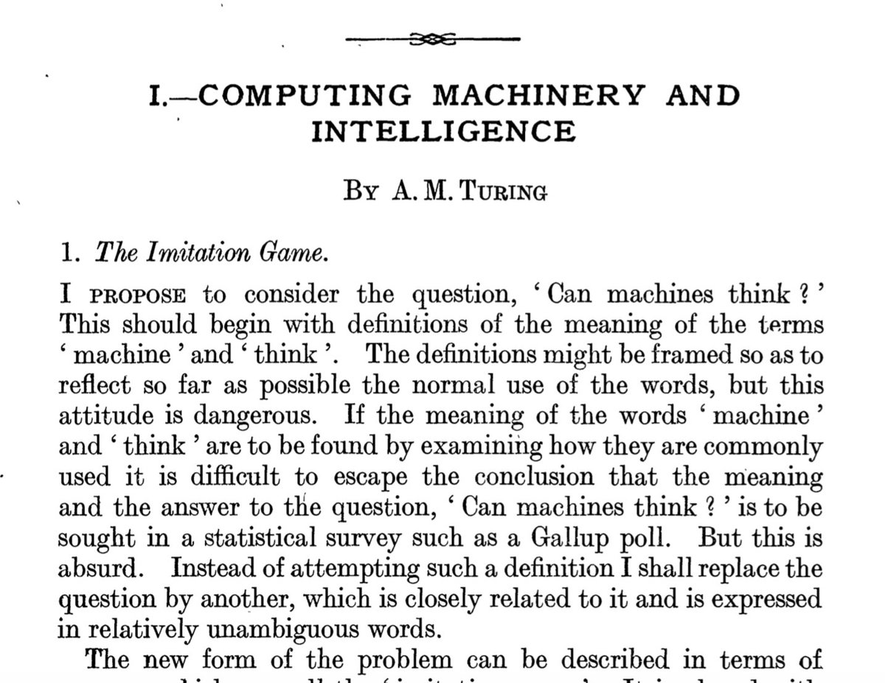

---
title: Introdução à Inteligência Artificial
subtitle: Fevereiro de 2022
author: Fabrício Barth 
institute: Agentes Autônomos e Aprendizagem por Reforço
date: 02/2022
theme: insper
aspectratio: 169
...

# Origens da IA

## 1950 Turing's "Computing Machinery and Intelligence" 

The Imitation Game: "Can machines think?"



## 1956 Dartmouth meeting "Artificial Intelligence" adopted

\begin{center}
\includegraphics[width=0.7\textwidth]{figuras/dartmouth.png}
\end{center}

## Objetivos da IA

**Teórico**: a criação de teorias e modelos para a
  capacidade cognitiva. Compreender o que é inteligência e como o
  raciocínio se processa.

  \vspace{1cm}

**Prático**: a implementação de sistemas computacionais
  baseados nestes modelos. Implementar sistemas computacionais que
  resolvem problemas que outros sistemas, implementados usando
  técnicas tradicionais, não conseguem resolver.

## Etapas relacionadas com o objetivo teórico da IA

* Algo que possui um **comportamento** considerado inteligente
  (humano, uma sociedade de formigas, ...). 

* Cria-se um **modelo** para esta "inteligência".

* Cria-se **ferramentas**, implementado os modelos definidos.

* Implementar **aplicações** usando as ferramentas
  implementadas.

* O **comportamento das aplicações** implementadas pode ser
  considerado inteligente?

## Referências que valem a pena! 

:::::::::::::: {.columns}
::: {.column width="50%"}
* **The Imitation Game**. 2014. Directed by Morten Tyldum. 
* **Entrevista com o John McCarthy** (1927-2011), 1989. [https://www.youtube.com/watch?v=Ozipf13jRr4](https://www.youtube.com/watch?v=Ozipf13jRr4)

* Minsky, Marvin (1986). **The Society of Mind**. New York: Simon & Schuster. ISBN 0-671-60740-5.

* McCarthy, John. **What is AI?**. [http://jmc.stanford.edu/articles/whatisai.html](http://jmc.stanford.edu/articles/whatisai.html). November, 2007.
:::
::: {.column width="50%"}
\includegraphics[width=0.6\textwidth]{figuras/imitation_game.png}
:::
::::::::::::::

# Marcos da IA

## IBM Deep Blue vence Kasparov (1997)

\begin{center}
\includegraphics[width=0.6\textwidth]{figuras/deep_blue.jpg}
\end{center}

## Criação do Dataset MNIST (1998)

:::::::::::::: {.columns}
::: {.column width="50%"}
\includegraphics[width=1\textwidth]{figuras/mnist.jpeg}
:::
::: {.column width="50%"}
The MNIST database of handwritten digits

\vspace{0.5cm}

```{.python}
from keras.datasets import mnist
(train_X, train_y), 
(test_X, test_y) = mnist.load_data()
```

\vspace{0.5cm}

Em 2012 existe uma solução que tem erro de teste igual a 0.23% [[http://yann.lecun.com/exdb/mnist/]](http://yann.lecun.com/exdb/mnist/)

:::
::::::::::::::

## Veículos autônomos 

A equipe de Stanford ganha a competição da DARPA no deserto (2005)

\begin{center}
\includegraphics[width=0.6\textwidth]{figuras/car_stanford.jpg}
\end{center}

## Criação do Dataset ImagineNet (2009) 

:::::::::::::: {.columns}
::: {.column width="50%"}
\includegraphics[width=1\textwidth]{figuras/image_classification.png}
:::
::: {.column width="50%"}

Este dataset possui 14.197.122 imagens anotadas de acordo com a taxonomia da WordNet. Desde 2010 este dataset é usado na competição *ImageNet Large Scale Visual Recognition Challenge* (ILSVRC) e é um benchmark clássico para **classificação de imagens** e **reconhecimento de objetos**.

:::
::::::::::::::

## IBM Watson vence no Jeopardy (2011)

\begin{center}
\includegraphics[width=0.5\textwidth]{figuras/watson.jpg}
\end{center}

A partir de **2015** proliferação de **assistentes virtuais** que fazem uso de **classificação de texto** para compreensão das intenção de uma sentença.

## AlphaGO e AlphaGO Zero vencem no GO (2016)

:::::::::::::: {.columns}
::: {.column width="50%"}
\includegraphics[width=0.8\textwidth]{figuras/alphago.png}
:::
::: {.column width="50%"}
\includegraphics[width=1\textwidth]{figuras/go.jpg}
:::
::::::::::::::

# O que existe de comum nestes exemplos?

## O que existe de comum nestes exemplos?

* Todos têm um objetivo bem claro. Uma função de utilidade muito bem definida. 

* Todos estão inseridos em um ambiente muito bem controlado, exceto o veículo autônomo 
(questionável no caso da competição). 

* Todos podem ser vistos como agentes orientados a meta. 

<!-- ## Desafios

* Less data

* Fairness

* Truth

-->

# O que é um agente orientado a meta ou agente autônomo?
