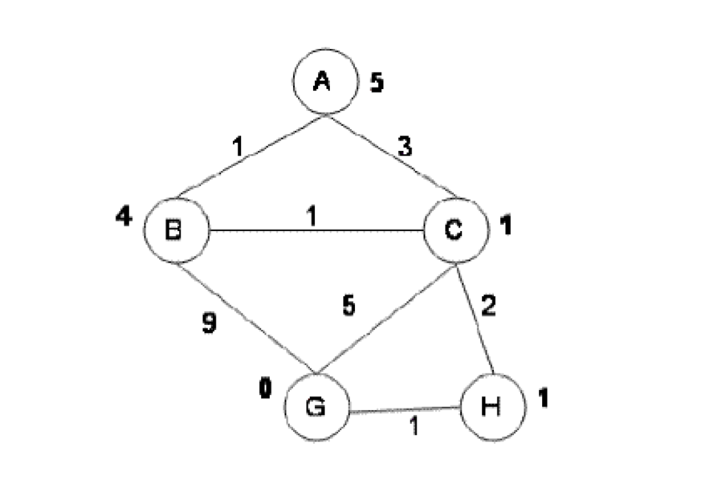
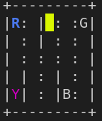
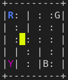
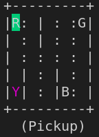
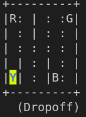

# Exercícios sobre busca em espaço de estados: parte 3

Esta lista de exercícios possui os exercícios que deverão ser entregues. A avaliação dos mesmos irá compor a nota final da disciplina. Todos os exercícios devem ser realizados individualmente. 

## Questões básicas sobre Algoritmos de Busca 

* **Peso da nota**: 10% da nota final
* **Data de entrega**: 24/03/2022 via Blackboard

As questões abaixo devem ser respondidas e entregues via blackboard. Cada questão tem peso igual. 

a. Considere o grafo abaixo onde o número sobre as arestas é o custo de
cada ação e o número  próximo de cada nodo é a heurística considerada até o
estado objetivo. Note que cada arco é bidirecional. Considere o estado A
como inicial e o estado G como o estado objetivo. Em todos os algoritmos utilizados existe um único tipo de poda da árvore de busca que é: não pode-se abrir nenhum sucessor
igual ao pai do nodo.

<p align="center">

</p>

    1. Desenhe a árvore que o algoritmo A* cria. Detalhe a árvore o máximo possível. Em cada nodo aberto na árvore descreva o custo para chegar naquele nodo mais o valor fornecido pela heurística.
    2. Descreva o caminho para a solução do problema que o algoritmo A* encontra.
    3. A heurística utilizada no problema é admissível? Explique.
    4. O algoritmo A* é ótimo se o valor da função *h* fosse igual a 0 (*h(n) = 0*)? Justifique.
    5. O algoritmo A* é ótimo se o valor da função *f* for sempre 0 (*f(n) = g(n) + h(n) = 0*)? Justifique.

b. Descreve qual é a principal diferente entre os algoritmos Subida da Montanha e os demais algoritmos que fazem uso de heurísticas vistos nesta disciplina.

c. Considere os problemas das cidades. No exercício realizado em sala de aula foi utilizado com grafo com dezenas de nodos e uma heurística baseada na distância em linha reta entre os nodos. O que seria necessário fazer para utilizar esta solução em uma situação real, com milhares ou dezenas de milhares de nodos?

## 8-Puzzle

* **Peso da nota**: 20% da nota final
* **Data de entrega**: 31/03/2022 via Blackboard

Considere o problema dos *8-puzzle* discutido em sala de aula. Implemente uma solução para este problema. 

<p align="center">

</p>

A entrega da sua implementação deverá ter 3 arquivos:

* Arquivo `python` que implementa a interface `State`;
* Arquivo de teste `test_8_puzzle.py` que especifica testes utilizando a biblioteca pytest;
* Arquivo README.md que descreve como os estados são representados, como os sucessores são gerados e outras informações que você julgar relevantes (i.e., heurística, etc). 

*Cuidado* ao gerar os estados iniciais de forma aleatória. Nem todos os estados iniciais tem solução!

O arquivo de teste precisa ter no mínimo 5 testes considerando 5 estados iniciais distintos. Onde 4 estados iniciais precisam ser válidos e 1 estado inicial é não válido. Para o estado inicial não válido a solução precisa retornar a mensagem *"Nao achou solucao"*. 

Abaixo são apresentados exemplos de estados iniciais. Começando com um estado inicial **fácil** de ser resolvido: 

| 8 | 1 | 3 |
|:-:|:-:|:-:|
|   | 7 | 2 |
| 6 | 5 | 4 |

Três estados difícieis de serem resolvidos: 

Exemplo 1: 

| 7 | 8 | 6 |
|:-:|:-:|:-:|
| 2 | 3 | 5 |
| 1 | 4 |   |

Exemplo 2:

| 7 | 8 | 6 |
|:-:|:-:|:-:|
| 2 | 3 | 5 |
|   | 1 | 4 |

Exemplo 3:

| 8 | 3 | 6 |
|:-:|:-:|:-:|
| 7 | 5 | 4 |
| 2 | 1 |   |

E dois estados que são impossíveis de serem resolvidos: 

Exemplo 1: 

| 3 | 4 | 8 |
|:-:|:-:|:-:|
| 1 | 2 | 5 |
| 7 |   | 6 |

Exemplo 2:

| 5 | 4 |   |
|:-:|:-:|:-:|
| 6 | 1 | 8 |
| 7 | 3 | 2 |

O seu agente deve ser capaz de identificar um plano para todos os estados iniciais descritos como fáceis e difícieis acima. Para os estados descritos como impossível o agente precisa retornar a mensagem *"Nao achou solucao"*. Deve-se considerar o estado *goal* em formato caracol, como apresentado abaixo:

| 1 | 2 | 3 |
|:-:|:-:|:-:|
| 8 |   | 4 |
| 7 | 6 | 5 |


### Rubrica da avaliação 

| Conceito | Definição |
|:---------|:----------|
| Insuficiente (I) | Não fez a especificação do problema, definindo como representar os estados do mundo, como gerar os sucessores e qual algoritmo deveria ser escolhido para este problema. |
| Em Desenvolvimento (D) | Gerou uma documentação descrevendo como representar os estados do mundo e como implementar os sucessores, mas não terminou a implementação e nem a especificação dos casos de teste. |
| Básico (C) | Implementou uma solução que representa corretamente os estados do mundo e gera os sucessores corretamente. Mas não implementou uma heurística admissível e favorável (que permite uma busca mais eficiente). Além de ter entregue a implementação da solução, também entregou os casos de teste e a documentação. |
| Esperado (B) | Implementou uma solução que representa corretamente os estados do mundo, gera os sucessores corretamente e tem uma heurística admissível, mas não necessariamente favorável. Como consequência tem uma solução que sempre encontra uma solução ótima, mas o cálculo da solução pode levar mais que alguns segundos. Além de ter entregue a implementação da solução, também entregou os casos de teste e a documentação.  |
| Avançado (A) | Implementou uma solução que representa corretamente os estados do mundo, gera os sucessores corretamente e tem uma heurística admissível e favorável. Como consequência tem uma solução que sempre encontra uma solução ótima em um tempo aceitável (na ordem de segundos). Além de ter entregue a implementação da solução, também entregou os casos de teste e a documentação. |
| Avançado (A+) | Além de implementar tudo que está descrito no item anterior (A), também implementou uma interface gráfica onde é possível visualizar a sequência de movimentos de um estado inicial aleatório para o estado final.|

## Taxi Driver com mapa completo 

* **Peso da nota**: 20% da nota final
* **Data de entrega**: 07/04/2022 via Blackboard

O objetivo deste exercício é implementar um *taxi driver* que é capaz de definir uma sequência de atividades para pegar um 
passageiro em um lugar e deixá-lo em outro lugar. Para implementar uma solução para este problema nós vamos utilizar uma biblioteca 
que simula diversos ambientes. O nome desta biblioteca é `gym` e faz parte do projeto [OpenAI](https://gym.openai.com/).

Para que você possa utilizar este ambiente, você precisa executar as seguintes linhas de código: 

````bash
# no diretorio raiz do projeto
cd diretorio_projeto
# atualize o codigo local do projeto
git pull
# utilize o ambiente virtual jah configurado
source venv/bin/activate
# atualize os pacotes que estao instalados no ambiente virtual
python -m pip install --upgrade pip
pip install -r requirements.txt
````

A partir deste momento você já está apto a executar os comandos que estão no arquivo [../code/search/TaxiDriverGym_introducao.py](../code/search/TaxiDriverGym_introducao.py). Neste arquivo você irá ver como manipular um ambiente chamado [Taxi-v3](https://gym.openai.com/envs/Taxi-v3/) que faz parte da biblioteca *gym*.

Ao executar a sequência de linhas de comando abaixo: 

````python
import gym
env = gym.make("Taxi-v3").env
state = env.reset()
env.render()
````

você irá criar um ambiente do tipo *táxi*, inicializar um estado qualquer e imprimir o estado na tela: 

<p align="center">

</p>

a imagem acima descreve um estado onde:
* o táxi é o retângulo amarelo (o amarelo indica que ele está sem passageiro),
* o passageiro está na posição onde tem um R azul. Toda letra quando pintada com azul significa que o passageiro está lá.
* e o passageiro precisa ser entregue na posição Y *purple*. Toda letra quando da cor *purple* significa que o passageiro precisa ser deixado lá. 

Neste mesmo desenho temos lugares por onde o táxi pode passar (:) e lugares que estão bloqueados (|). 

O agente *táxi* sabe executar as seguintes ações: 

* 0 = south
* 1 = north
* 2 = east
* 3 = west
* 4 = pickup
* 5 = dropoff

O objetivo do agente é encontrar uma sequência de ações para pegar um passageiro em qualquer um dos 4 pontos e levar o passageiro para qualquer um dos 4 pontos, respeitando os obstáculos do mapa. Por exemplo, ao executar as seguintes ações: 

````python
>>> state, reward, done, info = env.step(0)
>>> state, reward, done, info = env.step(0)
>>> state, reward, done, info = env.step(3)
````

O agente sai do estado: 

<p align="center">

</p>

e chega no estado: 

<p align="center">

</p>

continuando, se o agente executar: 

````python
>>> state, reward, done, info = env.step(1)
>>> state, reward, done, info = env.step(1)
>>> state, reward, done, info = env.step(3)
>>> state, reward, done, info = env.step(4)
````

ele chega neste estado: 

<p align="center">

</p>

perceba que a cor do retângulo mudou. Isto significa que agora o passageiro está no táxi. 

Se continuarmos com a sequência de ações: 

````python
>>> state, reward, done, info = env.step(0)
>>> state, reward, done, info = env.step(0)
>>> state, reward, done, info = env.step(0)
>>> state, reward, done, info = env.step(5)
````

chegamos ao estado: 

<p align="center">

</p>

neste momento o valor da variável **done** é `True` (`state, reward, done, info = env.step(5)`). Isto significa que o agente atingiu um estado que é meta. 

Este ambiente simulado normalmente é utilizado para o desenvolvimento de agentes que não possuem uma representação completa do estado. Por isso que não existe um método em `env` que retorna uma representação completa do estado atual. No entanto, até o momento só estudamos nesta disciplina técnicas que precisam ter uma representação completa do estado. Por isso vamos ter que acessar os atributos da instância `env` para que o nosso agente possa criar uma representação completa do ambiente:

````python
print(env.desc)
taxi_row, taxi_col, pass_idx, dest_idx = env.decode(state)
print(taxi_row, taxi_col, pass_idx, dest_idx)
````

O atributo `env.desc` fornece uma representação textual do mapa apresentado acima: 

````python
>>> env.desc
array([[b'+', b'-', b'-', b'-', b'-', b'-', b'-', b'-', b'-', b'-', b'+'],
       [b'|', b'R', b':', b' ', b'|', b' ', b':', b' ', b':', b'G', b'|'],
       [b'|', b' ', b':', b' ', b'|', b' ', b':', b' ', b':', b' ', b'|'],
       [b'|', b' ', b':', b' ', b':', b' ', b':', b' ', b':', b' ', b'|'],
       [b'|', b' ', b'|', b' ', b':', b' ', b'|', b' ', b':', b' ', b'|'],
       [b'|', b'Y', b'|', b' ', b':', b' ', b'|', b'B', b':', b' ', b'|'],
       [b'+', b'-', b'-', b'-', b'-', b'-', b'-', b'-', b'-', b'-', b'+']],
      dtype='|S1')
````

Com esta representação é possível saber onde tem obstáculos, onde o agente pode passar e onde estão as letras R, G, Y e B estão. 

O método `decode` retorna a posição do táxi, onde o passageiro está e qual o destino do passageiro: 

````python
>>> taxi_row, taxi_col, pass_idx, dest_idx = env.decode(state)
>>> print(taxi_row, taxi_col, pass_idx, dest_idx)
0 2 0 2
````

Neste caso o táxi está na linha 0 e na coluna 2. O passageiro está na letra R e o seu destino é a letra Y (R = 0, G = 1, Y = 2, B = 3). Se o passageiro estiver no táxi então o valor de `pass_idx` é igual a 4. 

Com estas informações é possível criar uma representação para todos os estados que são sorteados pelo comando `env.reset()`.

Considerando o código abaixo: 

````python
import gym
env = gym.make("Taxi-v3").env
state = env.reset()
env.render()
taxi = MeuTaxi(env.desc, env.decode(state))
for a in taxi.path():
    state, reward, done, info = env.step(a)
    env.render()
if done:
    print("Soube encontrar a solucao correta")
else:
    print("Não soube encontrar a solução")
````

Você terá que desenvolver o `MeuTaxi` que retorna uma sequência de ações (através do método `path()`). Perceba que ao instanciar um objeto do tipo `MeuTaxi` são passadas todas as informações sobre o estado inicial e final. O agente deve calcular todo o plano e retornar a sequência de ações através do método `path()`. A iteração: 

````python
for a in taxi.path():
    state, reward, done, info = env.step(a)
    env.render()
````

vai fazer com que o agente execute uma ação por vez e imprima o estado atual, criando assim um efeito de movimentação na tela. 

Se ao final da execução do `for` o agente encontrar um estado onde `done == True` então significa que o agente soube encontrar um plano válido. 

A entrega da sua implementação deverá ter 3 arquivos:

* Arquivo `python` que implementa a interface `State`;
* Arquivo de teste `test_taxi_driver.py` que especifica testes utilizando a biblioteca pytest;
* Arquivo README.md que descreve como os estados são representados, como os sucessores são gerados e outras informações que você julgar relevantes (i.e., heurística, etc).

### Rubrica da avaliação 

| Conceito | Definição |
|:---------|:----------|
| Insuficiente (I) | Não fez a especificação do problema, definindo como representar os estados do mundo, como gerar os sucessores e qual algoritmo deveria ser escolhido para este problema. |
| Em Desenvolvimento (D) | Gerou uma documentação descrevendo como representar os estados do mundo e como implementar os sucessores, mas não terminou a implementação e nem a especificação dos casos de teste. |
| Básico (C) | Implementou uma solução que representa corretamente os estados do mundo e gera os sucessores corretamente. Mas não implementou uma heurística admissível e favorável (que permite uma busca mais eficiente). Além de ter entregue a implementação da solução, também entregou os casos de teste e a documentação. |
| Esperado (B) | Implementou uma solução que representa corretamente os estados do mundo, gera os sucessores corretamente e tem uma heurística admissível, mas não necessariamente favorável. Como consequência tem uma solução que sempre encontra uma solução ótima, mas o cálculo da solução pode levar mais que alguns segundos. Além de ter entregue a implementação da solução, também entregou os casos de teste e a documentação.  |
| Avançado (A+) | Implementou uma solução que representa corretamente os estados do mundo, gera os sucessores corretamente e tem uma heurística admissível e favorável. Como consequência tem uma solução que sempre encontra uma solução ótima em um tempo aceitável (na ordem de segundos). Além de ter entregue a implementação da solução, também entregou os casos de teste e a documentação. |

